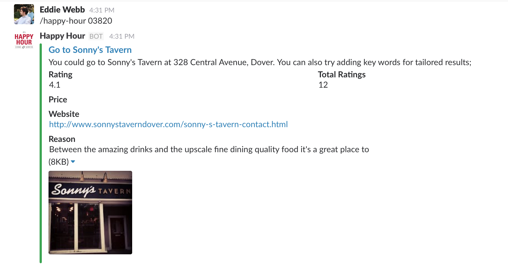
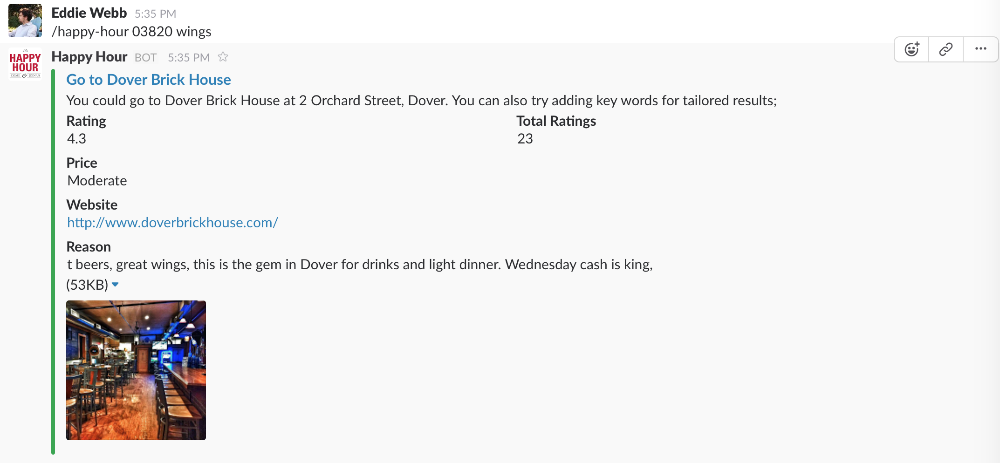

# SLack Happy hour Decider
A slash-bot for Slack to help your team decide where they head tonight!

## What it do
Queries Google Places API for nearby bars, restaurants with a decent rating, and keyword of choice. Default keyword is "drink".

## Samples
`/happy-hour 03820`

`/happy-hour 03820 wings`

## INstall
Just get a key from google console and save as api.key

Once you add the integration to slack as a "Slach Custom Integration" it shoudl give you a "token" Save that as slack.token to only allow that integration to call your servce.
